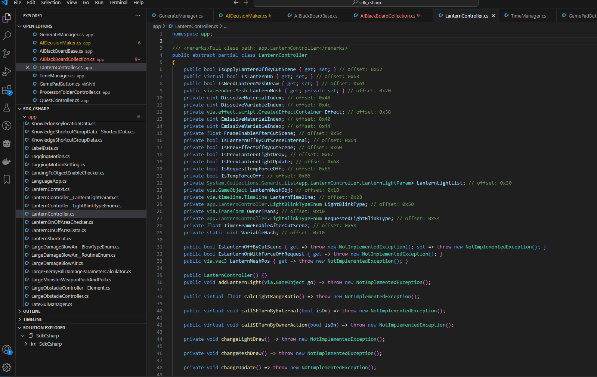
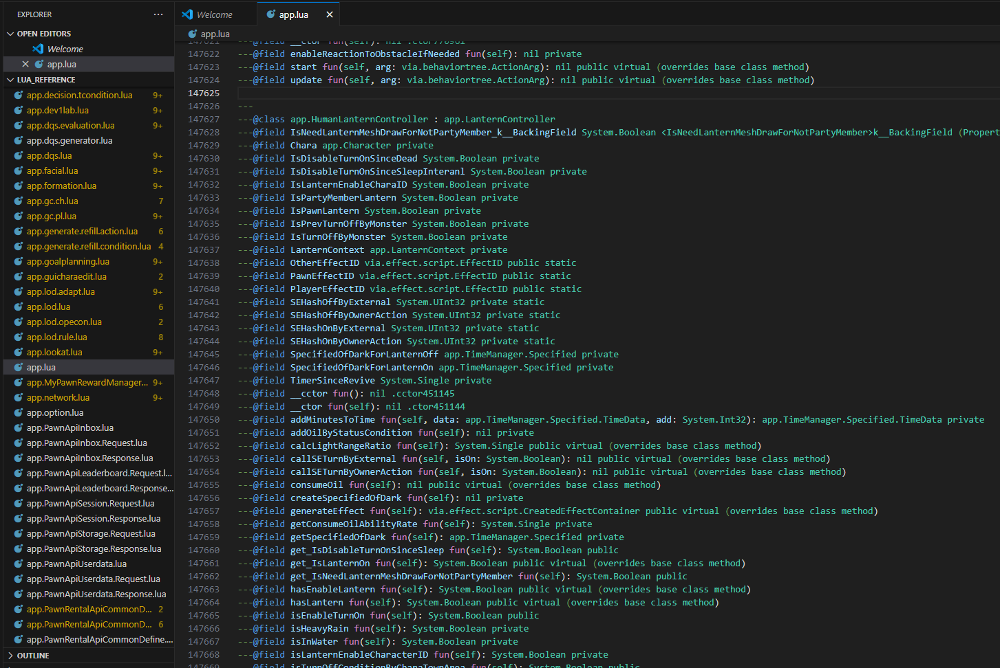

# REFDumpFormatter

Command line tool to convert the il2cpp dump JSON generated by REFramework into a usable reference C# project or lua type definitions. Tested with DD2 and DMC5, should work for any game with REFramework support assuming there's no big differences in the il2cpp dump format. The output code is not compilable, nor can it be used directly for a plugin/mod, it's meant purely for reference purposes instead of having to go ingame and deal with the clunky Object Explorer UI. Check the status of praydog's C# API for that.

The output for DD2 is about 30k files at 30 ish MB total, one file per class, so it could take a bit to generate everything if it's running on a slow drive, let it work.

```
Usage: il2cpp_dump_formatter.exe <path_to_il2cppdump> [<output_file_path>] [OPTIONS]

path_to_il2cppdump: Should be the path to the REFramework generated il2cpp_dump.json file
output_file_path: If not set, it will default to il2cpp_dump.json directory + /csharp_reference or /lua_reference depending on chosen format

Output format options:
    --generate-csharp Generate C# classes (default)
    --generate-lua Generate LuaCATS annotations
Additional options:
    --field-offsets   Include the field offsets in the output, useful when reverse engineering the executable (crashes) or native code
    --include-overloads Include all method overloads
    --ignore-overloads Ignore method overloads (emit only the first occurrence)
    --namespace-files Write all classes into a shared file corresponding to its namespace
    --class-files Write all classes into their own file
```

## Requirements
- .NET 8.0

## Running from release
- generate the `il2cpp_dump.json`: launch the game with REFramework installed and go under DeveloperTools > ObjectExplorer > Dump SDK, then wait for it to finish (will probably crash during the IDA SDK dump step but that's fine, you can also quit the game early)
- Download the latest version from the releases page
- Run the file and answer the questions
- Alternatively, run from command line: `il2cpp_dump_formatter.exe "C:/Program Files (x86)/Steam/steamapps/common/Dragons Dogma 2/il2cpp_dump.json" "E:/mods/dd2/csharp_reference" --generate-csharp`

(adjust the paths if you have the game installed elsewhere or want to change the output folder)

## Setting up source
- clone repository
- open up a command line in the repository folder
- `dotnet restore`

## Lua project library setup
To enable the generated type hints in your own mod, the Lua extension by sumneko for VSCode lets you define a .luarc.json file at the root of your workspace and point at a library folder to seamlessly include all type info from there (though it might decide to die because of the sheer volume, so you may want to only take out the classes you care about into a separate folder), like so:

```json
{
  "$schema": "https://raw.githubusercontent.com/LuaLS/vscode-lua/master/setting/schema.json",
  "workspace.library": ["C:/mods/dd2/lua_reference"],
  "runtime.version": "Lua 5.4",
  "hint.enable": false
}
```





## Quirks for C# output
- The tool emits both the base generic method as well as all "specialized" type variations that they were used with in the base game. These are not valid for C#, but are included because the il2cpp dump includes them and might be useful to know which types are available to use ingame. You can use the `--ignore-overloads` flag to remove the extras.
- There might be some non-virtual redefined fields that should be marked as `new` but such cases are rare enough

## Known limitations
- The il2cpp dump doesn't provide all the info that REF itself knows (ingame dev tools show them)
    - Some parameters aren't named and typed properly (most notably, some delegate parameters; ingame dev tools usually show them)
    - class name in the dump seems to be limited to 1023 length (partially breaks `app.AIBlackBoardCollection<>` specifically)
- No support for array of arrays (they do seem to exist but not sure how well REF even supports them either)
- Compiler-generated lambdas (`.<>c__DisplayClass`, `.<>c**`) don't get emitted
- Generic classes nested within generic clases are not supported (I think)
